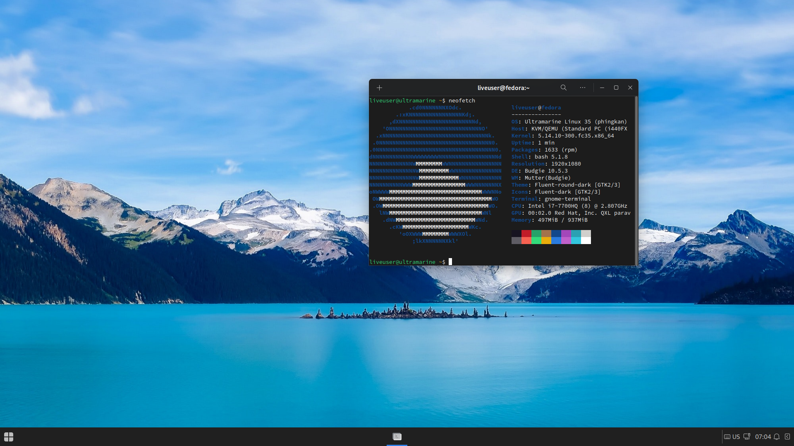

# Ultramarine Linux

Ultramarine Linux is a Fedora Remix designed to be simple and stays out of the user's way.

# Instructions
Simply download the ISO and follow the instructions provided.

# Build Instructions
You should have a copy of Fedora, Ultramarine, RHEL, or any member of the EL family installed on the build machine.

To compose Ultramarine, you will need to at least have PyKickstart and [Lorax](https://weldr.io/lorax/) installed.

```
sudo dnf install lorax pykickstart
```

Then, simply run the Makefile. (Superuser privileges are required to mount the image on composition.)
```
sudo make flagship
```
or:

```
sudo make spin=budgie image
```

# Known Issues
- On some configurations, Lorax may get stuck or even fail to compose the image. In this case, you can try running the build under a container. It's recommended to use [GitLab-CI-Local](https://github.com/firecow/gitlab-ci-local) to run the build in a container, or use [Toolbox](https://docs.fedoraproject.org/en-US/fedora-silverblue/toolbox/).
- Anaconda will may still recognize this image as a pre-release. This is because the image does not have a final buildstamp, and the composition process might be unable to do this. (Onceler will fix this in the future.)
